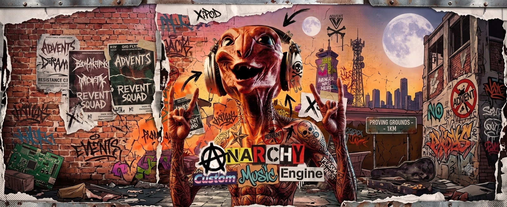
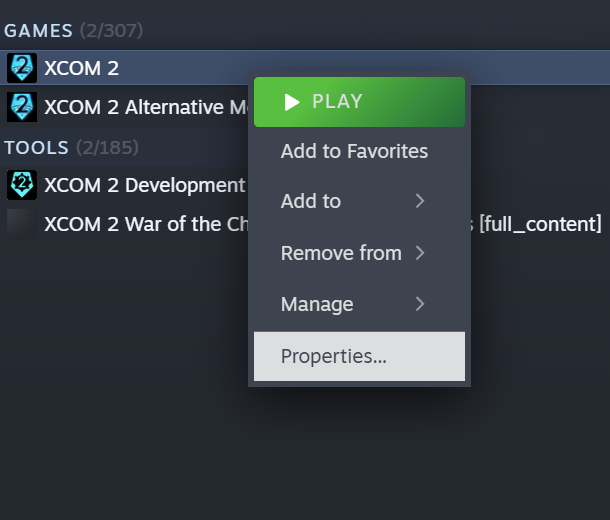
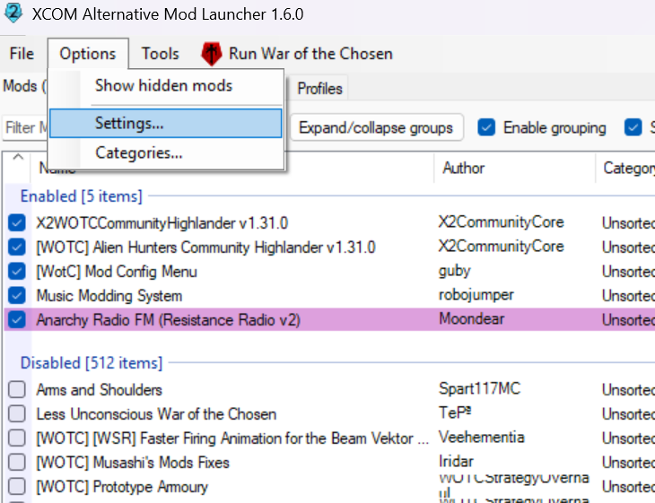
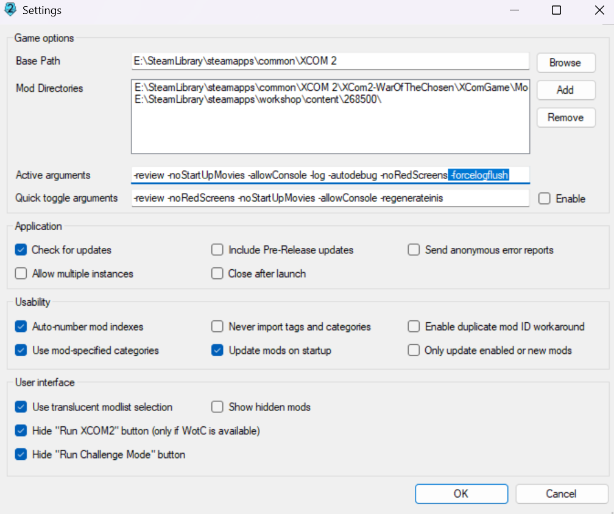
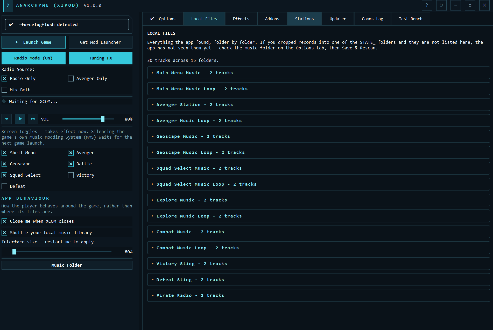
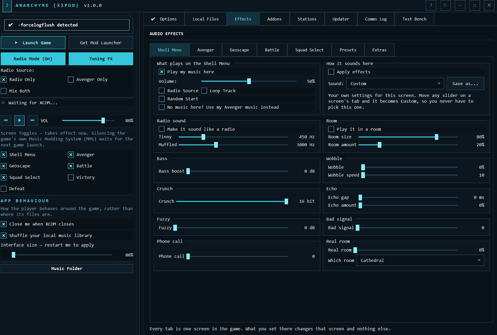
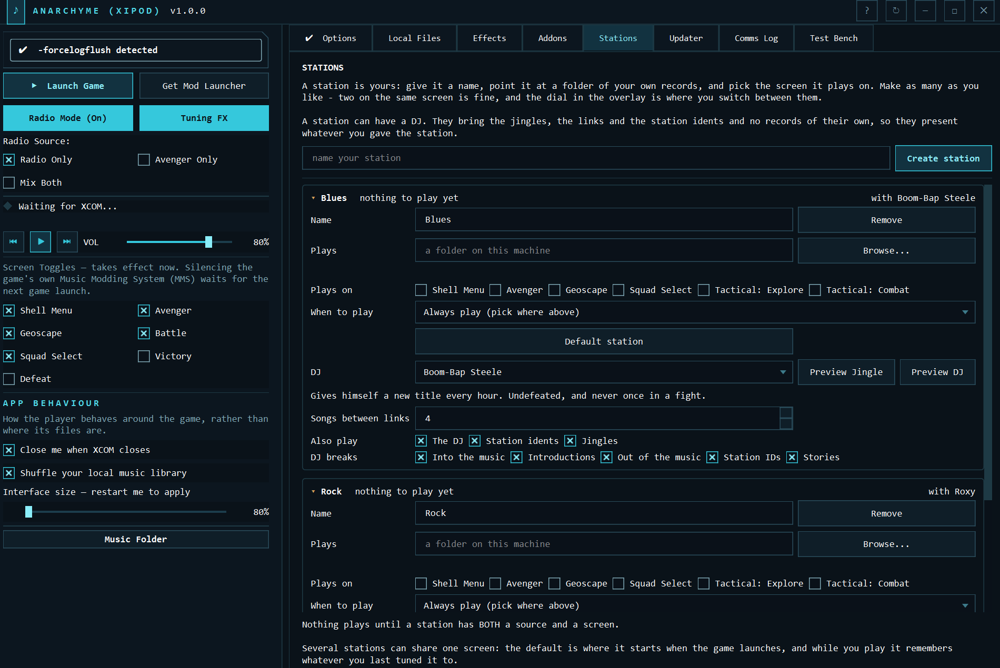
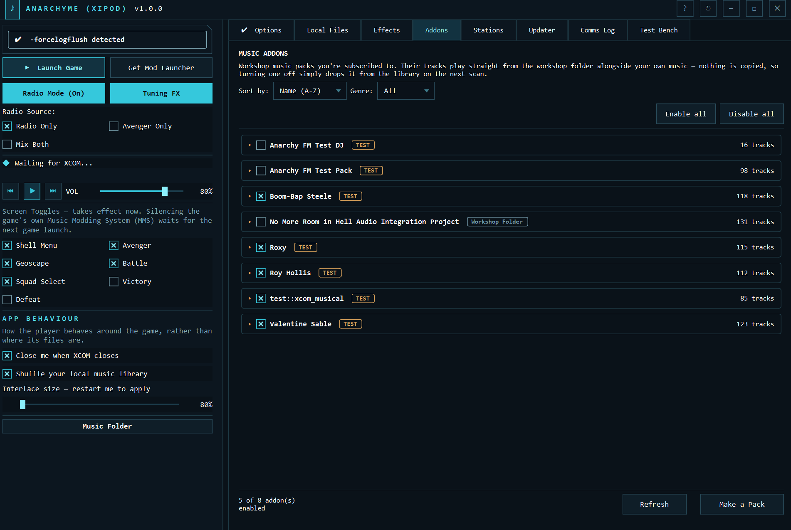
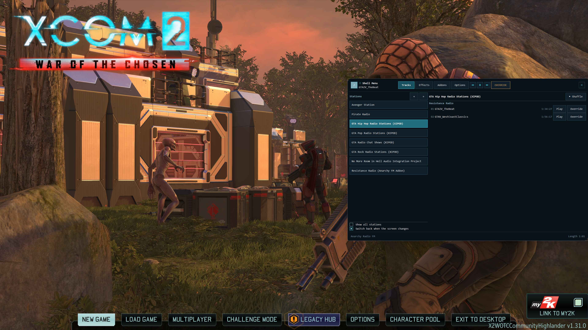

<p align="center">
  
</p>

<h1 align="center">XCOM 2: Anarchy Music Engine</h1>

<p align="center">
  <strong>Files in folders. XCOM plays them.</strong>
</p>

<p align="center">
  
  <a href="https://steamcommunity.com/sharedfiles/filedetails/?id=3796844123">
    
  </a>
  <a href="https://drive.google.com/drive/folders/1ALThBR63ANKujNiqlUrygeqxSCVFXRHA">
    
  </a>
  
</p>

---

## 📡 Your music, in XCOM 2

**Anarchy Music Engine switches XCOM 2's soundtrack off and lets you put your own music in.** You drop music files into folders. Each part of the game gets its own folder — the Avenger, the Geoscape, squad select, the firefight, the win and the loss. That's the whole pitch.

Here's how it works. XCOM writes a line into its own log file every time you move from one part of the game to another. This app watches that file and plays the folder that matches. It doesn't touch any game files, and it never copies or moves your music — it plays it where it sits.

Command's orchestral score is extremely tasteful and, forty hours in, extremely the same. So instead:

- 🎻 An orchestral score narrating the Geoscape while the planet quietly loses? Sure.
- 🤘 Something extremely loud the exact moment a Sectoid pops out of the dirt? Obviously.
- 💃 An hour-long DJ set over the Avenger, because you thought it'd be funny six hours ago and it's now permanently canon? Not our place to stop you.

> No converting files. No renaming them. No ffmpeg gymnastics. No `.upk` file the size of a small, angry moon. **Files, folders, an exe. Done.**

---

## 🚀 Get it running (four steps, Commander)

**1.** Subscribe to **[the mod](https://steamcommunity.com/sharedfiles/filedetails/?id=3796844123)**
and **[Music Modding System](https://steamcommunity.com/workshop/filedetails/?id=757398474)**.

> Both, not one, and both **enabled** as well as subscribed. Music Modding System's whole job is making the game's own soundtrack shut up; ours is playing yours instead. Skip it and you get two soundtracks fighting over the same speaker.

**2.** Add **`-forcelogflush`** to XCOM 2's launch options — the box where you type extra
options for the game before it starts.

> Skip this one and your music barges straight over every cinematic, uninvited, like it owns the place. **Do the step.**
>
> You don't have to do it blind: the app checks your launcher and says on its own front page whether the option is there. If it isn't and you're on the Alternative Mod Launcher, there's a **Fix it** button beside the line — it backs your `settings.json` up first and changes nothing else.

<details>
<summary><strong>Show me exactly where →</strong>&nbsp; (Steam, and the Alternative Mod Launcher)</summary>

<br>

**Steam** — right-click **XCOM 2 → Properties → General → Launch Options**, and
type it into the box at the bottom.

<table>
<tr>
<td width="50%"></td>
<td width="50%"></td>
</tr>
</table>

**Alternative Mod Launcher** — **Options → Settings → Active arguments**. Stick
it on the **end** of whatever's already in there. That existing text is doing a
job — don't wipe it out to make room.

<table>
<tr>
<td width="50%"></td>
<td width="50%"></td>
</tr>
</table>

</details>

**3.** **[Download the app](https://drive.google.com/drive/folders/1ALThBR63ANKujNiqlUrygeqxSCVFXRHA)**,
unzip it anywhere, **run `AnarchyME.exe`.** It doesn't install anything and it doesn't
want to live next to XCOM.

> No wizard to sit through. The settings panel opens on the **Options** tab — set your
> **Game Launcher / AML**, press **Find my paths**, and it works the rest out from there.
> Every folder box turns **green** when it's right and **red** when it isn't, right there on
> the tab, so a broken setup is the first thing you see rather than the last thing you find out.

**4.** Press **Create JSON File** to build the music folders, then drop your music into
them. **That's it.**

> **One rule about folders and it's the only one:** the `STATE_` folders play by
> themselves, and **only the music sitting directly inside them**. Put a file in a
> folder inside one and it won't play, unless you point a station at that folder.
> If you've left music somewhere nothing reads, the app says so out loud — *"Music
> nothing will ever reach — 2 folder(s)…"* — instead of quietly playing less music
> than you gave it.
>
> Takes `.mp3` `.ogg` `.wav` `.flac` `.m4a` `.opus` `.wma`. Check it landed on the
> **Local Files** tab, which lists every folder it found with a count and names every
> track underneath. That's the "did my drag-and-drop work?" question answered in one
> look, with no game running.

<p align="center">
  
</p>

> **⚡ Start the app first, then XCOM.** Always that order. The game reads the app's
> track list once at launch and cannot be made to read it again.

---

## 📻 The good bit: Radio Mode

One button. The Avenger tunes into a station, and **every single track drops you in at a random point** — like the broadcast has been running the whole time and you just wandered into the room mid-sentence.

**Try this:** find yourself an hour-long station rip — DJ banter, fake adverts, all of it — drop it into `STATE_RESISTANCE_RADIO/` and flip Radio Mode on. Every trip back to the ship lands you somewhere new: mid-song, mid-ad break, mid-rant about an energy drink that is legally, definitely, not a real brand.

Every one of those mid-track landings gets a short burst of tuning static in front of it, because that's what spinning a dial sounds like. Those clips come with the app; **Tuning FX** on the main window turns them off if you'd rather it didn't.

**Radio Mode lives on the Avenger and nowhere else**, deliberately — an hour of radio chat is downtime noise, and a DJ cracking wise mid-firefight kills the tension stone dead. You pick what it pulls from: the radio folder, your ordinary Avenger tracks (**"Avenger Only" is the sleeper hit** — it gives your existing library the tuned-in-halfway-through treatment with no radio folder at all), or both taking turns.

---

## 🎚️ Two kinds of music folder, and the difference matters

Everything a music pack gives you is one of two things, and the pack decides which.

**🎼 Soundtrack — the default.** You never see it listed anywhere. It plays in the background and changes with where you are in the game: the ship, the Geoscape, squad select, a firefight. A pack author who does nothing at all gets this, and for most packs it's the right answer — you want the music to follow the game, not to be a thing anybody has to choose.

**📻 Station — the pack asks for one.** A pack can put its own name on the **in-game dial** by asking for it in its settings file. You can then flick between stations, pick one, and your choice sticks.

So: not every folder is a station. Most music is a soundtrack, quietly doing its job. A station is what you build when you want to be able to *tune* to something by name.

You can build stations of your own too, on the **Stations** tab — that's the section below.

---

## 🎁 What else is in the crate

<table>
<tr>
<td width="42%"></td>
<td>

### 🎛️ Effects

**Fourteen sliders**, named in plain English — *Tinny*, *Muffled*, *Room size*, *Bass boost*, *Wobble*, *Crunch*, *Echo gap*, *Fuzzy*, *Bad signal*, *Phone call* and the rest. **One sub-tab for each part of the game**, so the Avenger and the Geoscape can sound nothing alike, and a **Sound** preset drops a whole character on one of them in one pick.

**You hear a slider land on the track that's playing** — mid-note, no restart — so dialling in a sound is listening rather than guessing.

Want the Avenger sounding like a field radio held together with tape, hope and a war crime? Two clicks.

Underneath, for anyone who owns a compressor on purpose: a **room simulator** that makes your music sound like it's playing in a real space, using a recording of that space — an *impulse response* — dropped into the `impulses` folder beside the app. And a **VST3 slot** at the end of the chain, if you have audio plugins of your own. Plus three ways one record becomes the next — **Hard Cut**, **Crossfade** or **Sweep**, which is what it ships with.

> We ship **no** impulse responses. The good ones are somebody's recording of somebody else's room and that licence isn't ours to hand out — bring your own. And **a room only plays if you pick one**: the dropdown opens on *Off*, and Off is what a fresh install gets. Same deal with the VST3 slot — a plugin is a program, not a settings file, so load ones you trust.

</td>
</tr>
<tr>
<td width="42%"></td>
<td>

### 📻 Stations

**Build your own dial.** A station is a thing you make: give it a name, point **Plays** at a folder of your own music, tick where in the game it plays. Everything under that folder counts, so aim it at `E:\Music` and think about it no further. Make as many as you like.

**Then give it a DJ.** Some packs ship a **presenter and no music** — the jingles, the station idents, the links between records, the ad reads, and a gap where the songs go. Pick one from the station's dropdown and they do their whole show over *your* records. Your library, their patter. Nobody ships four gigabytes of somebody else's songs to make it happen.

**Preview them first.** Two buttons — one plays a jingle of theirs, one plays them talking — so you know who you're hiring before you hire them. They play over the top without stopping whatever's already going, so you can audition four in a row.

**Several stations can share the same place in the game**, and **Default station** says which one the game starts on. **Songs between links** says how many of your records play before the presenter comes back, and the tick boxes for what else they play are built from what that pack actually ships.

</td>
</tr>
<tr>
<td width="42%"></td>
<td>

### 📦 Addons

Subscribe to a Workshop music pack and it **just shows up** in your library. Flip packs on and off, sort by name, genre or track count, and **nothing gets copied onto your drive** — tracks play straight out of the folder Steam already put them in, which is the only way a gigabyte-sized pack can ever be switched back *off* again.

**Not everything comes off the Workshop.** A pack a mate zips up and sends you goes straight into your **music folder** and turns up on the list beside the subscribed ones. Every card says which of the three places it came from, so you're never guessing. Hit **Refresh** and a pack that arrived after the app started is there without a restart.

There's no Save button — flick a switch and it's saved and rescanned about half a second later. **Your own music always wins** if a pack has a track with the same filename, so a pack can never quietly hide a track you put there yourself.

</td>
</tr>
</table>

Also on tap: **self-updating** — it parks your old version in its own folder next to the new one, and the Updater tab grows a **`Go back to v…`** button that puts it back and restarts, settings and presets untouched. Nothing is ever overwritten, every download is checked against a fingerprint of the real file before anything is touched, and a failed update puts it all back. (If a bad update ever stops the app opening at all, `update_manually.bat` sits next to the exe and does the same job from outside.)

Plus **separate settings for every part of the game**: volume, Sound preset, Loop, Random Start — all remembered exactly as you left it. And an **interface size** slider from 80% to 125%, because the app ships small on purpose and not every monitor agrees with that.

And a **Test Bench** tab, which is there in every build and switched off in all of them. Press *Arm test mode* and the app stops listening to XCOM and starts listening to a fake log you drive with buttons: transitions, moves from one part of the game to another, cinematics, combat cues, console commands, whole scenarios replayed at up to 50×. Every button writes a real log line and the app reads it exactly as it would read the game's, so if it works there it works in the game — handy for building a pack without launching XCOM forty times. Leave it alone and it does nothing at all.

---

## 🎛️ The overlay: the whole desk, riding over the game

Hit **`Ctrl+Alt+R`** mid-mission and the station comes to you. Closed, it's a few pixels of tab on the right edge of the screen. Open it and you get the desk:

| | |
| --- | --- |
| **Tracks** | What's on the station you're looking at. Hover a row: **Play** it once, or **Override** — your pick keeps going until the game moves you somewhere else, and there's a switch to make it keep going even then. |
| **Effects** | Volume, sound and effects for each part of the game. |
| **Addons** | Your music packs, ticked on and off without going back to the desktop. |
| **Options** | The keyboard shortcut, the edge tab, the tuning sting. |

Down the left is the station list with `«` `»` to walk the dial, and **Show all stations** to put every `STATE_` folder on the list too — off by default, because nobody tunes to Squad Select Music on purpose.

Three ways in: the keyboard shortcut, the edge tab, or **Show Overlay** on the tray icon. Switch the edge tab off if it's in your way — the other two still work.

<p align="center">
  
</p>

> **It's a second window from *our* exe, not something drawn inside XCOM.** That's the whole design: if the game ever crashes, we know for certain it wasn't us. Worst case our window dies and the music stops.

### 📢 Exclusive fullscreen? You lose the picture, not the controls

The overlay can only *draw* itself if XCOM is in **borderless-windowed** — that's one of the choices under display mode in the game's video options. In exclusive fullscreen the game owns the screen outright, and nothing in a window can get in front of it. That's how Windows works, not a bug we're quietly hoping you won't notice.

**The controls don't need a window, though.** Only the picture does.

| | Windowed / Borderless | Exclusive fullscreen |
| --- | :---: | :---: |
| **Console commands** | ✅ | ✅ |
| **Overlay shortcut** (`Ctrl+Alt+R`) | ✅ | ✅ |
| **Play, pause, next, back** (`Ctrl+Alt+P` / `N` / `B`) | ✅ | ✅ |
| **Actually seeing the overlay** | ✅ | ❌ |

Play, pause, next and back are handed to **Windows itself** rather than to any window, and they work from the moment the app starts. The console commands travel by log file: you type, XCOM writes a line, we read it and act on it. Neither route cares what your display settings say. **Borderless-windowed costs you nothing in XCOM 2 and gets you the lot**, so that's the recommendation — but if you're staying on exclusive fullscreen you're not locked out. You just don't get the pretty bit.

<details>
<summary><strong>⌨️ Changing the keyboard shortcuts (and why the media keys aren't the default) →</strong></summary>

<br>

All four shortcuts are set in **`xipod_config.json`**, a settings file sitting next to the
exe — the lines called `overlay_hotkey`, `hotkey_play_pause`, `hotkey_next` and
`hotkey_prev`. There's no box in the app to press a key into, because the overlay is
built never to become the active window, so it would never receive the key you pressed at it.
Open the file, change the value, restart the app. Leave a value empty and we don't claim
that shortcut at all, which is how you hand a combination back to whatever else wanted it.

`MediaPlayPause`, `MediaNext` and `MediaPrev` are accepted values if you'd rather use
the buttons on your keyboard. They are **not** the default on purpose: Windows gives a
media key to **one** program for the entire desktop, so press Next expecting some other
player and you'd be skipping a track in here instead.

If a combination is already taken, we say so in the comms log, name the one that was
lost, and carry on with the rest.

</details>

### 🎚️ Four commands, live on air right now

```
XiPodPlay      resume the broadcast
XiPodPause     kill the transmitter
XiPodNext      skip it, we won't be offended
XiPodPrev      back one, we'll pretend that didn't happen
```

<details>
<summary><strong>☝️ The console is locked by default — here's the key →</strong></summary>

<br>

The console is a box you can type commands into while the game is running, and XCOM 2
ships with it switched off. Add **`-allowconsole`** to your launch options — **the same
box you dropped `-forcelogflush` into** back at step 2, with a space between them:

```
-forcelogflush -allowconsole
```

Then, in game, press **`~`** to open the console. Depending on your keyboard
layout that key might be **`'`** or **`\`** instead — one of the three will do it.

</details>

<details>
<summary><strong>📡 And fourteen more →</strong></summary>

<br>

Eighteen in total. Not sure which version you've got? Type `XiPod` in the console —
it prints what your copy actually has, which beats guessing.

```
XiPod                  the whole list, printed straight into the console
XiPodHelp              same thing, for when you can't remember which

XiPodStates            the parts of the game your music is filed under, with counts
XiPodTracks            every track, id on the left
XiPodTracks avenger    ...only the ones filed under one of them
XiPodTrack 42          play track 42

XiPodStations          the packs on the dial, numbered
XiPodStations 3        ...what's on that one
XiPodStations Play 3   ...spin it, and take whatever comes up

XiPodRescan            re-read the music folders without leaving the game
XiPodRelease           stop overriding, back to the established programme
```

**`XiPodStates` and `XiPodStations` are one letter apart and they are not the
same thing.** States are the parts of XCOM your music is filed under. Stations are
what it came out of. If you typed one and got a list that made no sense, you
wanted the other.

**Type the number, not the name.** `XiPodStations` prints a numbered list, and
the number is there because plenty of packs have long names and the console
treats every space as the start of a new word. The whole name works too if you
fancy typing it — capital letters don't matter — but half of one matches nothing,
deliberately: a half-name that matched two packs would spin the wrong one and
never tell you.

**And the desk itself — every fader, every effect, every setting that belongs to one part of the game:**

```
XiPodOptions                   every group, every key, printed in full
XiPodSet fx bitcrush 8         one effect
XiPodSet toggle avenger off    ...same command, other half of the app
XiPodSet state_volume battle 70
XiPodConfig crossfade_ms 2500  the app's own options
XiPodPresetSave Dusty AM       save the sound you're on now, under a name
XiPodPresetDelete Dusty AM     forget one of yours
```

**The console uses the sliders' original names**, not the friendly ones on the
Effects tab — `bitcrush`, not `Crunch`. `XiPodOptions` prints the real list,
which is why it's the one to type first. The game doesn't check what you typed:
the app does, and it writes any complaint into the comms log, which is a window
you're on exclusive fullscreen precisely to avoid. So read the list, then type.

A few things stay off the console on purpose. **Folders and the game path** are
set in the app. **The keyboard shortcuts** are set in `xipod_config.json`. **The
VST3 plugin and the impulse response** are set on the Effects tab and nowhere
else. `Launch.log` is a shared file that every mod you have installed writes
into, and a line in it should not get to say which program this machine loads and
runs inside the audio chain.

The commands that print lists read a file the app writes — and **XCOM reads that
file once, when it launches.** Start the app before the game and the list is bang
up to date. Add a pack mid-session and you won't see it until next time you load
in. That's how XCOM loads its settings, not us cutting corners.

**[Full reference, with every option and every value it takes →](https://github.com/emzakit/xcom_ame_readme/wiki/Console-commands)**

</details>

---

## 🎙️ The comms log

The app keeps a running log of what it's doing — where you are in the game, which folder it picked, which track started, and what it couldn't find. It's the first place to look when something isn't playing, and the [troubleshooting guide](https://github.com/emzakit/xcom_ame_readme/wiki/Troubleshooting) reads it with you.

The flavour lines are stage dressing over that, and **the whole script sits in one file you can edit** — `helpers/dialogue.json`, in the app folder. Rewrite it, or strip it back to plain status lines. No code required.

Fault reports are the exception and stay put: warnings about paths, updates and things that actually broke are written where the breaking happens, because a fault report you can accidentally edit into saying something else isn't a fault report.

---

## 📚 The Codex

Everything past "run the exe" lives in the
**[wiki](https://github.com/emzakit/xcom_ame_readme/wiki)**.

| | | |
| --- | --- | --- |
| 📂 | Using the music folders | `music_readme.md`, in your music folder |
| ✨ | [Every feature, in detail](https://github.com/emzakit/xcom_ame_readme/wiki/Features) | The full tour |
| 🔧 | [Something's wrong](https://github.com/emzakit/xcom_ame_readme/wiki/Troubleshooting) | Two soundtracks, no music, known gremlins |
| 🛠️ | [Making your own music pack](https://github.com/emzakit/xcom_ame_readme/wiki/Making-a-music-pack) | Publish one to the Workshop |
| 📻 | [Programme a station](https://github.com/emzakit/xcom_ame_readme/wiki/The-format-clock) | Running orders: jingle, song, song, DJ, ad break |
| 🎙️ | [Stations](https://github.com/emzakit/xcom_ame_readme/wiki/Stations) | Your own dial — your music, a place in the game, and a DJ to present it |
| ⌨️ | [Console commands](https://github.com/emzakit/xcom_ame_readme/wiki/Console-commands) | All eighteen, every option, every value they take |
| ❓ | [FAQ](https://github.com/emzakit/xcom_ame_readme/wiki/FAQ) | The questions that keep coming up |
| ⚙️ | [How it works](https://github.com/emzakit/xcom_ame_readme/wiki/How-it-works) | And running it from source |
| 🔨 | [Building the exe](https://github.com/emzakit/xcom_ame_readme/wiki/Building-the-exe) | Compile it yourself, trust nobody |

---

## ⚠️ Mission briefing: the honest bit

Every mod page promises the moon. Here's what you actually get.

**✅ The Avenger and the strategy layer are the polished bits.** Main menu, ship, Geoscape, squad select, the post-mission summaries. You linger there, the app can tell exactly when you arrive, and it just works. That's where the hours went and I'll defend it without blinking.

**🚧 The tactical side is beta, and honestly you may not want us on it.** A firefight isn't you walking into somewhere new. It's a judgement about what's happening, worked out from a log file after the fact — so it can land late, or twice, or for a concealment break that came to nothing. **For combat we genuinely recommend Music Modding System packs instead.** You already need Music Modding System installed, it's already the thing that decides when combat starts, and it doesn't have to go via a log file to say so. Leave `STATE_MISSION_COMBAT/` empty and it takes combat straight back. Us for the ship, Music Modding System for the shooting.

**🎯 Spotting which enemy you're facing — pointing music at a Chosen or an Alien Ruler — is very experimental and genuinely buggy.** It can be missed entirely. Build a pack around a Chosen theme only if you're happy for it not to fire.

**🤝 Running a Music Modding System pack alongside this** works properly. Fill the folders you actually care about; the pack quietly covers everything else. Anything you switch off in the app is handed straight back to Music Modding System.

**Running LWOTC** (Long War of the Chosen) should be fine, although there might be things I haven't seen yet. Please report issues.

**[Report a bug →](https://github.com/emzakit/xcom_ame_readme/issues)**

> **🛡️ Scanner flagged the exe?**
> False alarm — [here's the VirusTotal report](https://www.virustotal.com/gui/file/351a46c0c7d0e426347231f49406b0f92fb4d1d4a975797c3a6c35c577b46b6c).
> The app is packed into one exe by a tool called PyInstaller, which stuffs a whole
> programming language in there with it. To an antivirus that looks **exactly** like what
> actual malware does — same wrapping paper, wildly different contents. Textbook mistaken
> identity. Don't trust a stranger's exe? Fair instinct.
> [Build it yourself.](https://github.com/emzakit/xcom_ame_readme/wiki/Building-the-exe)

---

## 🏅 Credits

Built squarely on the shoulders of
**[Music Modding System](https://steamcommunity.com/workshop/filedetails/?id=757398474)** —
none of this exists without it. Genuinely. Go thank them.

Open source because everything should be, and partly in the hope some XCOM
wizard smarter than me works out how to do this *inside* the game itself instead
of strapping an external music player to the side of it. That's the real dream.
I got close. I did not get there.

App and mod are both mine — **emzakit (Moondear)**. MIT licensed.

**Now go make the Avenger sound like *yours*, Commander.**

<p align="center">
  <a href="https://drive.google.com/drive/folders/1ALThBR63ANKujNiqlUrygeqxSCVFXRHA">Download</a>
  &nbsp;·&nbsp;
  <a href="https://steamcommunity.com/sharedfiles/filedetails/?id=3796844123">Steam Workshop</a>
  &nbsp;·&nbsp;
  <a href="https://github.com/emzakit/xcom_ame_readme/wiki">Wiki</a>
  &nbsp;·&nbsp;
  <a href="https://github.com/emzakit/xcom_ame_readme/issues">Report a bug</a>
</p>
